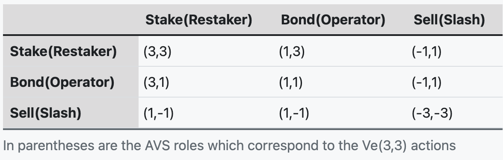

# FHE for Verisense

## Flash Auctions for Validator in Verisense Consensus
Verisense consensus involves auctions for slots and ordering of verifiers (or nodes), but currently existing models such as FHEVM are FHE models constructed on the blockchain, and we would like to expand to off-chain models such as AVS. We evaluate the simplicity and intuitiveness of FHE compared to Zk's form of auctions (e.g., Bulletproofs-based schemes), which are suitable for more rapid blind auction schemes.
## Voting for Veto Slashing
## Role Game for Verisense AVS
### An example in Ve(3,3)
A very typical example is the Ve(3,3) model proposed by OHM.

The Nash equilibrium of this game model is located at point (3,3), which in turn, allows the maximization of the Total Value Locked (TVL) for the whole ecosystem. Within just five months, the TVL of OHM rapidly escalated to $800M. Nonetheless, due to the inherent data transparency of the blockchain, this game is one of perfect information, meaning that all participants know each other's information. As such, this game only reaches Nash equilibrium briefly. The reason is that once you are aware of other participants starting to exit the system, you, too, would leave the game.

With the help of Fully Homomorphic Encryption (FHE), we can transform the perfect information game into an imperfect information game, thereby achieving the Nash equilibrium point.

